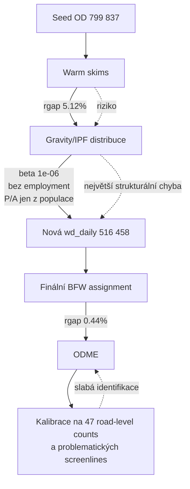

# Forenzní audit běhu Olomouc před ODME kalibrací

## Exekutivní závěr

Na základě poskytnutého logu je můj závěr nekompromisní: **tento běh ještě není metodicky připravený na ODME kalibraci**. Není to proto, že by pipeline byla špatně navržená jako celek; naopak, sekvence build-network → zones → demand → skims → distribute → assign → calibrate dává smysl. Problém je, že v tomto konkrétním běhu se sešlo několik chyb, které se **násobí**, nikoli jen sčítají: distribuce byla kalibrována na nekonvergovaných skimech, gravity krok skončil prakticky nulovou impedanční citlivostí, poptávka se po distribuci smrskla o zhruba 35 %, síť je z velké části postavena na odhadnutých rychlostech a kapacitách, a kalibrace vstupuje jen s velmi tenkou a geometricky problematickou sadou pozorování. Oficiální workflow AequilibraE doporučuje nejprve vytvořit skimy a spustit base-year assignment, teprve poté dělat trip distribution; oficiální příklady navíc běžně ukazují assignment se skimmingem na velmi těsný relative gap. citeturn3view0turn3view8turn11view6turn3view1

Kdybych tento model hodnotil jako akademický oponent, označil bych současný stav jako **“promising but not yet defensible”**. Před ODME je třeba zastavit a opravit zejména čtyři oblasti:  
první, **distribuční krok**; druhá, **supply-side věrohodnost sítě**; třetí, **geometrie connectorů a screenliní**; čtvrtá, **nezávislost a síla validačních dat**. To není purismus. Je to základ dobré praxe v dopravním modelování: kalibrace má stát na realistické síti, ODME má zachovávat vazbu na prior matrix, a validace nesmí být jen přejmenovaná rekalibrace na stejném typu dat. citeturn9view0turn3view6turn13view1turn13view0turn14search8

Datové zdroje, které v logu používáte, jsou samy o sobě legitimní, ale je nutné správně chápat jejich roli. Data o dojížďce od entity["organization","Český statistický úřad","czech statistical office"] jsou cenný základ pro pracovní a školní vazby mezi obcemi, nikoli kompletní automobilovou denní OD matici. Výstupy celostátního sčítání dopravy od entity["organization","Ředitelství silnic a dálnic","czech road agency"] pracují s RPDI a se sčítacími úseky na silniční síti; jsou výborné pro validaci proudů na vybraných tazích, ale samy o sobě nepokrývají plnohodnotně intraměstskou ulici po ulici a nejsou náhradou za prostorově a časově bohatou validační datovou bázi. citeturn11view0turn11view1turn11view2turn11view3

## Co log skutečně dokazuje

Následující tabulka je čistě forenzní výtah z vašeho logu, tedy bez interpretace:

| Oblast | Pozorování z běhu |
|---|---|
| Síť | 30 012 linků, 26 680 uzlů |
| Konektivita | 1 neorientovaná komponenta, ale 94 directed SCC; largest SCC 26 570 uzlů |
| Heuristická oprava sítě | 116 jednosměrných major linků bylo přepsáno na obousměrné |
| Normalizace atributů | odhadnuto 18 343 rychlostí a 30 008 kapacit; 1 218 linků mělo asymetrii lanes/capacity |
| Zóny | 177 zón celkem, z toho 28 externích gateway zón |
| Connectory | 950 connectorů, pevně 6 na zónu |
| Varování u connectorů | 8 zón má nejbližší connector dál než 1 500 m; extrém 6 284 m |
| Supernetwork | auto-discovered 28 gatewayí, pro hlavní supernetwork ponecháno jen 7 |
| Seed OD | 799 837 voz/den |
| Segmenty seed OD | commuting 395 707; other 92 648; external_local 275 690; external_through 35 793 |
| Warm skims | BFW, 30 iterací, nekonvergováno: rgap 0,051186 |
| Distribuce | impedance ze skimů, ale z nekonvergovaného běhu; EXPO beta = 1e-06; bez employment dat |
| Distribuce – efekt | matice klesla z 799 837 na 516 458 |
| Finální assignment | BFW, 97 iterací, rgap 0,004409 |
| Pozorovaná data pro kalibraci | po filtraci CSD jen 47 road-level link observations |
| Screenlines | 47 definovaných; řada gateway screenliní resolved jen na 1 link místo očekávaných 2 |
| Duplicity screenliní | více různých screenliní padá na stejné link_id, např. několik variant 150_* na link 3738 |

Tato čísla sama o sobě neříkají, že model je nepoužitelný. Ale říkají, že **hlavní problém neleží v tom, že by assignment “nespadl”, nýbrž v tom, že se před ODME posouvá do kalibrace už metodicky zdeformovaná kombinace sítě, impedance a pozorování**. To je přesně ten typ stavu, v němž ODME často “vypadá chytře”, ale ve skutečnosti léčí špatnou věc. Tento závěr je plně v souladu s klasickou literaturou o OD odhadu z countů a s oficiálními doporučeními pro sekvenční kalibraci a validaci. citeturn13view1turn13view0turn3view6turn11view5

## Nejzávažnější metodické poruchy

### Distribuce stojí na nekonvergovaných skimech a téměř nulové impedanci

Tohle je největší červená vlajka celého běhu. Warm-skim assignment skončil na `rgap=0.051186`, tedy zjevně mimo cíl warm passu `0.01`, a přesto byl použit jako impedance pro gravity/IPF. Současně gravity krok odhadl `beta = 1e-06` pro exponenciální deterrence. Matematicky to znamená skoro plochou funkci: pro exponenciální tvar \(f(c)=e^{-\beta c}\) je při \(\beta=10^{-6}\) rozdíl 30 minut v nákladu řádově zanedbatelný. Jinými slovy, **vaše distribuce v tomto běhu skoro nereaguje na impedanci**, i když formálně používá “skim”. To je přesný opak toho, co doporučuje oficiální workflow AequilibraE: nejprve base-year assignment a finální skim, pak kalibrace gravity modelu a IPF. Oficiální příklady navíc explicitně říkají, že vstupem do distribuce je final-iteration skim z assignmentu. citeturn3view0turn3view8turn11view6

Ještě vážnější je, že distribuční krok zredukoval denní matici z 799 837 na 516 458, tedy o přibližně **35,4 %**. V logu zároveň stojí: `No employment data found, using symmetric population-based P/A` a `external zones exported with population=0`. V praktickém smyslu to znamená, že IPF cílí na produkce/atrakce založené jen na populaci, bez zaměstnanosti a se zerovými externími zónami. To je pro mě **strukturální chyba**, ne jen “parametr k doladění”. U regionálně otevřeného modelu s výraznou externí složkou je velmi pravděpodobné, že takový krok dusí externí vazby a přepisuje strukturu seed matice ve směru, který není behaviorálně obhájený. citeturn9view0turn11view0turn11view1

### OD seed je příliš heterogenní a ODME by na něm suplovalo demand model

Seed OD obsahuje směs pracovně-školní dojížďky, “other” z gravity proxy, externě-lokálních cest odhadovaných “auto” z CSD a datově řízeného external-through. Samotná struktura je rozumná; problém je, že jednotlivé složky nemají stejnou epistemickou kvalitu. Dojížďka mezi obcemi od ČSÚ je legitimní seed pro pracovní a školní vazby, ale není to kompletní denní automobilová poptávka. Naopak CSD od ŘSD je count source na vybraných komunikacích, nikoli přímá OD informace. Kdykoli pak směs takových zdrojů vstoupí do ODME bez silného prioru a bez plně důvěryhodné sítě, county začnou opravovat nejen poptávku, ale i chyby sítě a chyby segmentace. Klasická literatura OD estimation na tom stojí od Bella dál: pozorované linkové proudy škálují **prior** OD matici, nejsou její plnou náhradou; survey literatura současně zdůrazňuje, že OD odhad z countů vyžaduje “target” nebo jinou dodatečnou informaci, protože jinak je problém podurčený. citeturn13view1turn13view0turn0search2

Váš log navíc ukazuje, že `external_local` bylo auto-odhadnuto na 275 690 voz/den z CSD gateway roads a `external_through_data` bylo poté ještě násobeno `through_traffic_scale=0.50`. To je modelářsky přípustné jako **heuristický seed**, ale nikoli jako konečná pravda. Hodnoty tohoto typu mají být předmětem sensitivity testu a screenline validace, ne zabetonovaným výchozím stavem pro následné ODME. FHWA v guidebooku explicitně požaduje O-D informace po vehicle types a časových řezech, konzistentní s ground counts a zároveň napojené na širší travel-demand model nebo jiné behaviorální zázemí. citeturn9view0turn3view6

### Síť je sice topologicky průjezdná, ale supply-side je stále z velké části syntetická

Na první pohled vypadá síť dobře: undirected connectivity je v pořádku, všechny centroidy jsou připojené a finální BFW došel na `rgap=0.004409`. To však samo o sobě nestačí. Klíčový problém je v tom, že log říká `estimated: speed=18343, capacity=30008`. Přeloženo do běžné modelářské řeči: **všechny kapacity a většina rychlostí jsou imputované**, nikoli empiricky ověřené. Následný “Supply audit: PASS” tedy neznamená, že jsou kapacity správně; znamená jen, že leží v rozumném rozsahu podle interní tabulky. Oficiální dokumentace AequilibraE je v tom jasná: VDF parametry se mají kalibrovat s použitím observed speed-flow nebo travel time-volume dat, po typech zařízení, a výsledky se mají validovat proti countům i rychlostem. citeturn11view7turn3view5

Ještě závažnější je heuristická oprava `Boundary SCC repair`, která převedla **116 jednosměrných major links na obousměrné**. Rozumím motivaci: nechcete mít gatewaye mimo hlavní directed SCC. Ale z metodického hlediska je to velmi invazivní zásah. FHWA opakovaně zdůrazňuje, že na routing a delay jsou extrémně citlivé právě detaily jako směrnost, lane connectivity, rampy, pocket lanes a geometrii křižovatek; není dobrá praxe je hromadně “spravovat” změnou směrovosti bez ručního auditu. V reálném městském či příměstském modelu raději přijmu menší coverage externích vazeb než masivní přepis fyzického směru provozu na major network. citeturn9view0

### Connectory a screenlines jsou geometricky nejslabším článkem

AequilibraE vytváří centroid connector tak, že hledá nejbližší nebo N nejbližších uzlů v zóně. To je v pořádku jako základní mechanismus, ale ne jako důkaz kvality. Ve vašem běhu jsou vygenerovány **pevně 6 connectorů na každou zónu**, což je u malých i velmi velkých zón příliš rigidní schéma. Log pak sám hlásí 8 zón s nejbližším connectorem dál než 1 500 m, z toho jedna extrémně přes 6 km. To je u statického assignment modelu významný zdroj biasu: dlouhý centroid connector mění generalized cost, route choice i to, které koridory budou přetěžovány. Oficiální dokumentace AequilibraE popisuje connect_mode jako čistě geometrický “nearest nodes” postup; to je právě důvod, proč musí následovat analytická kontrola a u problémových zón ruční zásah. citeturn3view2turn3view4

Ještě horší je stav screenliní. Váš log opakovaně hlásí “resolved 1 link(s) but expected 2” a zároveň ukazuje, že více různých gateway screenliní padá na **stejný link_id**. Nejkřiklavější příklad je tah 150, kde několik různých auto_gw screenliní opakovaně míří na link 3738; podobně 449_* na 60638, 447_* na 134 a 47_SE/47_SE_2 na 8605. To má dva tvrdé důsledky. Zaprvé, screenline geometrie není věrná cut-line představě. Zadruhé, kalibrační objektivní funkce může **převážit jeden stejný koridor vícekrát**, protože tváříte-li se, že máte několik nezávislých screenliní, ale ve skutečnosti měříte tentýž link, dostává ten link nadměrnou váhu. Validační materiály TMIP a WisDOT výslovně požadují screenline report, link-level srovnání a dokumentovanou interpretaci odchylek; to implicitně předpokládá, že screenliny jsou geometricky konzistentní a nepřinášejí skryté duplicity. citeturn11view4turn11view5turn7search1

### Kalibrační a validační sada je příliš tenká a hrozí leakage

Po regionálním a silničním filtru CSD zůstalo 328 sekcí na 155 road refs, ale road-level kalibračních pozorování je jen **47**. Na síť s 30 tisíci linky a 177 zónami je to málo, zvlášť když část screenliní geometricky kolabuje na stejné linky. Finální kalibrace tedy nevstupuje se 47 skutečně nezávislými informacemi, nýbrž se sadou, jejíž **efektivní informační obsah je ještě nižší**. To by samo o sobě nebyl konec světa pro subarea model, kdyby byly k dispozici nezávislé travel times, speeds, gateway screenlines a časové řezy; z logu ale zatím nic takového nevidím. FHWA výslovně rozlišuje kalibraci a validaci: validace má být test na **jiném** souboru existujících dat. citeturn3view6turn11view4turn11view5

Podobně důležité je, že finální assignment s `rgap=0.004409` sice splnil váš target `0.005`, ale je to pořád poměrně měkká rovnováha na model, který chcete dále kalibrovat pomocí ODME. AequilibraE měří konvergenci relative gapem a ve svých demonstračních pracovních tocích běžně ukazuje mnohem těsnější konvergenci se skimmingem. Path4GMNS, což je dnes nejbližší srovnatelná open-source větev pro UE+ODME, navíc dokumentuje velmi přímo, že před ODME má proběhnout UE. Váš běh UE má, což je dobře; problém je, že před UE už byla poptávka strukturálně narušena distribučním krokem a že observed layer je slabá. citeturn11view6turn3view8turn14search8turn14search2

## Jak se tento běh liší od referenční otevřené praxe

Tři referenční workflow jsou zde obzvlášť relevantní.  
Oficiální workflow AequilibraE staví forecasting tak, že nejprve vznikne base-year assignment a skimy, a teprve potom se kalibruje gravity model a aplikuje distribuce. Open-source Path4GMNS dokumentuje, že ODME je až následník UE, nikoli jeho náhrada. A guidebook od entity["organization","FHWA","us federal highway admin"] pro DTA/subarea modelování požaduje disaggregaci TAZ, nové centroids/connectors, napojení na širší demand model a sekvenční kalibraci s nezávislou validací. citeturn3view0turn3view8turn14search8turn9view0

| Referenční workflow | Co je v něm klíčové | Co se v tomto běhu děje jinak |
|---|---|---|
| Oficiální AequilibraE forecast workflow | base-year assignment → finální skim → gravity/IPF → další assignment citeturn3view0turn3view8 | distribuce běží na warm skim s nekonvergovaným rgap 0,051 |
| Path4GMNS UE + ODME | ODME je kalibrace **po** UE a na UE výsledku citeturn14search8turn14search2 | formálně UE máte, ale až po distribučním kroku, který strukturálně přepsal matici |
| FHWA subarea / ODME | jemnější TAZ, nové connectors, seed z vyššího modelu, validace screenlines + local links, nezávislá validace citeturn9view0turn3view6 | zóny a connectory jsou částečně geometricky problematické a observed layer je tenká a duplicovaná |

Má interpretace je tedy jednoduchá: váš běh je **architektonicky podobný správnému workflow, ale v nejcitlivějším místě porušuje jeho logiku**. To je horší než “mít méně funkcí”; máte totiž pipeline, která umí udělat hodně, ale snadno si sama přenese chybu z jednoho kroku do dalšího. citeturn3view0turn9view0turn14search8

## Prioritní zásahy před dalším během

Následující tabulka je podle mě správné pořadí zásahů. První čtyři body beru jako **blokéry**, bez jejichž opravy bych ODME nespouštěl.

| Priorita | Problém | Proč je kritický | Konkrétní oprava |
|---|---|---|---|
| P0 | Distribuce na nekonvergovaných skimech | kazí impedanci ještě před ODME | používat jen skimy z plného base-year assignmentu; cíl nejvýše `rgap ≤ 1e-3`, ideálně níž |
| P0 | Distribuce přepisuje celou `wd_daily` matici | smíchá interní, externí a through segmenty do jednoho IPF problému | distribuovat jen interní segmenty, typicky `other` nebo explicitně HBW/HBO/NHB; externí a through držet mimo gravity/IPF nebo pro ně definovat samostatné cíle |
| P0 | Bez employment dat a s `beta=1e-06` | gravity krok téměř nenese prostorovou informaci | doplnit employment / jobs / školní atrakce; pokud beta znovu spadne k nule, gravity pro tento segment nepoužívat |
| P0 | Duplicity a chyby screenliní | nadváží stejné linky a znehodnocují ODME gradient | screenliny ručně zrevidovat; deduplikovat link IDs; pokud `expected_links=2` a realita je 1, kalibraci zastavit |
| P1 | 116 jednosměrných major linků přepsaných na obousměrné | může systematicky měnit routing u vnějšího okraje modelu | změnit “boundary SCC repair” z automatické opravy na diagnostiku + ruční whitelist |
| P1 | 8 zón s příliš dlouhými connectory | mění generalized cost a funneluje proudy | problémové zóny rozdělit, zvětšit síťový záběr nebo manuálně připojit na vhodné uzly |
| P1 | Všechny kapacity a většina rychlostí jsou imputované | supply audit PASS není důkaz validity | doplnit observed speed/travel time data a kalibrovat VDF po typech komunikací |
| P1 | Jen 47 road-level count observations | kalibrace je slabě identifikovaná | přidat další count sources, corridor counts, probe speeds a travel times |
| P2 | Holdout validace je slabá | hrozí leakage a přeučení | oddělit geografický holdout, časový holdout a oddělené gateway/screenline holdout sety |
| P2 | Through traffic scale 0.50 je heuristika | forecasty budou citlivé na arbitrární knob | povinně dělat sensitivity suite na ±25–50 % kolem této hodnoty |

Tyto zásahy nejsou jen “doporučeními pro lepší publishable fit”. Jsou to opatření, která vracejí model do souladu s tím, co požadují oficiální workflow AequilibraE, open-source UE→ODME praxe a kalibrační příručky pro dopravní modelování: nejprve věrohodná síť a impedance, potom teprve OD adjustment a nezávislá validace. citeturn3view0turn11view7turn9view0turn3view6turn14search8

```mermaid
flowchart LR
    A[Build network] --> B[Ruční audit směrovosti a boundary repairs]
    B --> C[Build zones a oprava problematických connectorů]
    C --> D[Build demand seed po segmentech]
    D --> E[Plný UE assignment se skimy]
    E --> F[Distribuce jen interních segmentů]
    F --> G[Znovu UE assignment]
    G --> H[Ruční audit screenliní a duplicit]
    H --> I[ODME]
    I --> J[Nezávislá validace]
```

## QA checklist pro další iteraci

Tento checklist bych považoval za minimální podmínku, aby další běh měl šanci být metodicky obhajitelný:

| Kontrola | Podmínka pro “splněno” |
|---|---|
| Skimy pro distribuci | vznikly z assignmentu, který skutečně konvergoval |
| Gravity parametr | beta není numericky téměř nulová bez vysvětlení |
| P/A vektory | mají věrohodné atrakce, ne jen symetrickou populaci |
| Externí zóny | nejsou nulově “potrestány” v distribuci, pokud se distribuce aplikuje na celou matici |
| Connector audit | žádná zóna nemá neobhájený dlouhý connector; problémové zóny jsou ručně přezkoumané |
| Boundary repair | žádná automatická změna směrovosti major links není bez mapového auditu |
| Supply audit | nekončí jen “range check passed”, ale obsahuje i fit na counts/speeds/travel times |
| Screenlines | žádná duplikační kaskáda typu více screenliní → jeden a tentýž link |
| Observed data | county, screenlines a rychlosti mají oddělený calibration a holdout set |
| Assignment quality | relative gap je dostatečně těsný pro účel ODME a scénářových běhů |
| Validation report | zahrnuje link volumes, GEH, RMSE, screenlines a modeled vs observed s komentářem k odchylkám |
| Sensitivita | běh je testován na změny connectorů, gatewayů, VDF a externí poptávky |

Tento checklist odpovídá tomu, co v různých podobách požadují validační manuály TMIP/FHWA a státní validační standardy, například od entity["organization","WisDOT","wisconsin dot"]. Zvlášť důležité je, že validovaný base-year model ještě sám o sobě nezaručuje věrohodný future-year forecast; je třeba dokumentace, holdout testy a reasonableness checking. citeturn11view4turn11view5turn7search1

## Limity tohoto auditu

Tento audit je záměrně forenzní a před-ODME. Posoudil jsem stav **do okamžiku vstupu do kalibrace**, nikoli výsledky dalších ODME iterací, finální validační report ani scénářové forecasty. Proto netvrdím, že model už teď “určitě selže” v každém koridoru. Tvrdím něco přesnějšího: **v tomto stavu by jakýkoli pozdější dobrý fit nebyl dostatečně věrohodný, protože pre-ODME stav už obsahuje několik strukturálních deformací**. Tento závěr stojí na poskytnutém logu a je plně konzistentní s oficiální metodickou literaturou a referenčními open-source workflow. citeturn3view0turn9view0turn14search8turn11view5

Kdybych měl uzavřít jednou větou: **největší problém vašeho běhu není samotné ODME, ale to, že do ODME vstupujete s poptávkou a observed layer, které už byly metodicky narušeny o krok dřív**. Dokud se tohle neopraví, nebude kalibrace důkazem kvality modelu, ale spíš důkazem elasticity kalibračního algoritmu.